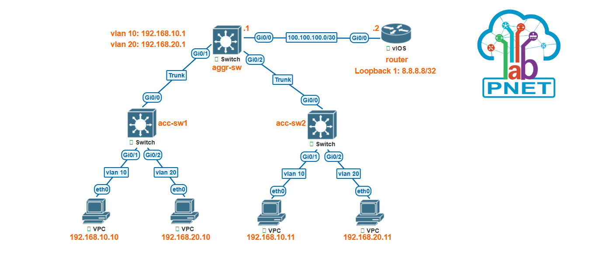

# Packet Forwarding


## router
```
conf t
hostname router 

int gig 0/0
no sh
ip addr 100.100.100.2 255.255.255.252
ip ospf 1 area 0

int loopback 1
no sh
ip addr 8.8.8.8 255.255.255.255
ip ospf 1 area 0
```
## aggr-sw
```
en 
conf t
hostname aggr-sw
ip routing

int gig 0/0
no switchport 
no sh
ip addr 100.100.100.1 255.255.255.252
ip ospf 1 area 0

int range gig 0/1-2
switchport trunk encapsulation dot1Q
no negotiate auto
switchport mode trunk

interface vlan10
no sh
ip addr 192.168.10.1 255.255.255.0
ip ospf 1 area 0

interface vlan20
no sh
ip addr 192.168.20.1 255.255.255.0
ip ospf 1 area 0
exit

router ospf 1
passive-interface default
no passive-interface gig 0/0
```

## acc-sw1
```
en
conf t
hostname acc-sw1

int gig 0/0
switchport trunk encapsulation dot1Q
switchport mode trunk

int range gig 0/1-2
switchport host

int gig 0/1
switchport access vlan 10

int gig 0/2
switchport access vlan 20
```

## acc-sw2
```
en
conf t
hostname acc-sw2

int gig 0/0
switchport trunk encapsulation dot1Q
switchport mode trunk

int range gig 0/1-2
switchport host

int gig 0/1
switchport access vlan 10

int gig 0/2
switchport access vlan 20
```

And I have mannually set the below ip addresses on PCS as follows:
### acc-sw1 subsets:
* vpc1: ip 192.168.10.10 / 24 192.168.10.1
* vpc2: ip 192.168.20.10 / 24 192.168.20.1

### acc-sw2 subsets:
* vpc1: ip 192.168.10.11 / 24 192.168.10.1
* vpc2: ip 192.168.20.11 / 24 192.168.20.1


# Verifying
## router
```
sh ip cef
sh ip cef checksum  | begin \[ip add]
sh ip cef checksum  | include \[ip addr]
```

## aggr-sw
```
show arp
show adjacency detail
```
The result was:
- vlan 10: *\[corr Mac addr to 192.16.10.10]\[corr Mac addr to 192.16.10.1]0800*

- gig 0/0 (next hop): *\[corr Mac addr to next hop: 100.100.100.2]\[corr Mac addr to gi 0/0: 100.100.100.1]0800*

The code 0800 shows the payload of the packet is IP.

# Complementary Points
* There is already **ip cef** cmd on **router \& L3 sw** in GNS3 \& PNETLAB. (**sh ip cef**)
* There is already **ip routing** cmd on **L3 sw** in GNS3 \& PNETLAB.
* For excluding interfaces which no ip is assigned to in show ip interface brief: sh ip int br **|** **exc una**
* To prevent entering ospf packets to our LAN network: **the common interface btw router and aggr sw** must be on **no passive-	interface** mode, and **other interfaces of aggr sw** on **passive-interface 	default**

* **switchport host:**
**switchport mode** on interface will be set to **access**.**spanning-tree portfast** will be enabled. **EtherChannel** will be **disabled** on that interfae

* show ip arp (showing to which devices arp/garp packets have been sent)

